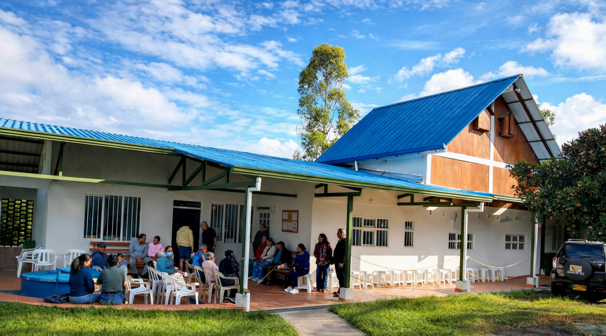
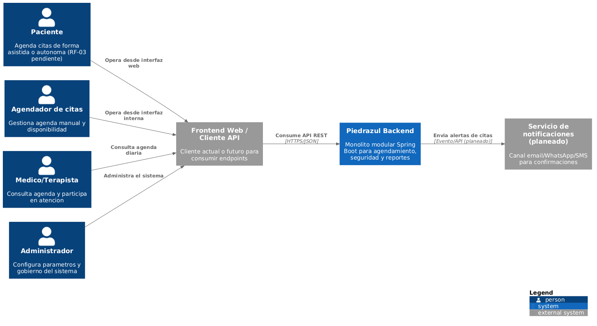
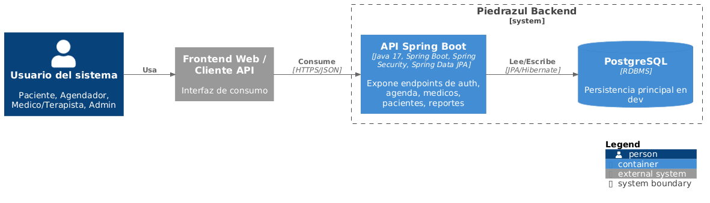
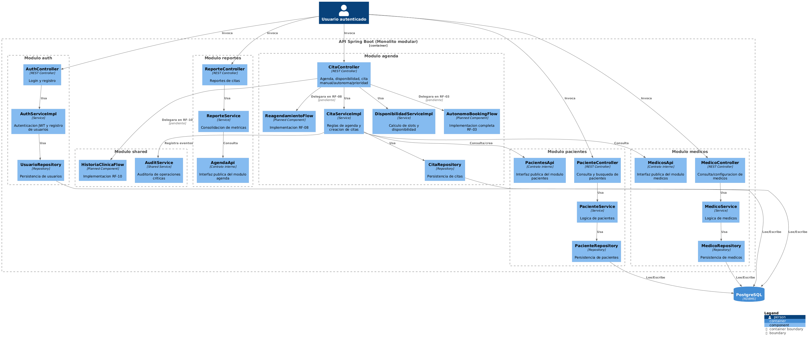

# Piedrazul Backend
La Red de Servicios Medicos de Piedrazul atiende procesos de agendamiento para medicina alternativa con alta demanda diaria. El backend se construye para reemplazar practicas manuales y sistemas previos con una plataforma web segura, trazable y mantenible.

Objetivos de producto:

- Centralizar la gestion de citas.
- Reducir friccion operativa en agenda clinica.
- Aplicar control de acceso por roles.
- Habilitar evolucion hacia autogestion de pacientes.

Roles principales:

- Administrador
- Agendador de citas
- Medico/Terapista
- Paciente

Documento de respaldo: [`01-contexto.md`](docs/01-contexto.md)

## Arquitectura en una mirada

El backend sigue un enfoque de **monolito modular** con Spring Boot, separando dominios por modulo (`auth`, `agenda`, `medicos`, `pacientes`, `reportes`, `shared`) y conservando bajo acoplamiento mediante contratos internos (`*Api`).

Capas tecnicas principales:

1. Controller
2. Service
3. Repository
4. Base de datos

Tecnologias base: Java 17, Spring Boot, Spring Security (JWT), Spring Data JPA, PostgreSQL (dev), H2 (test), Spring Modulith.

## Modulos del monolito modular

El sistema esta organizado por modulos de dominio. Cada modulo expone una frontera publica (`*Api`) y encapsula su logica interna (controllers, services, repositories, entidades).

| Modulo | Responsabilidad principal | Endpoints principales |
| --- | --- | --- |
| `shared` | Capacidades transversales: seguridad JWT, auditoria y excepciones comunes | Sin endpoints directos |
| `auth` | Login y registro de usuarios | `/auth/login`, `/auth/register/*` |
| `agenda` | Creacion/consulta de citas y disponibilidad | `/citas/agenda`, `/citas/manual`, `/citas/disponibilidad/*`, `/citas/agenda-dinamica`, `/citas/agenda-dinamica/stream`, `/citas/prioridad`, `/citas/autonomo` |
| `medicos` | Catalogo de medicos y configuracion de agenda por medico | `/medicos`, `/medicos/{medicoId}/configuracion` |
| `pacientes` | Consulta y busqueda de pacientes, soporte de autocompletado | `/pacientes`, `/pacientes/{id}`, `/pacientes/buscar` |
| `reportes` | Reporteria agregada de citas | `/reportes/citas` |

### Comunicacion entre modulos

Principio: ningun modulo consume clases internas de otro modulo; la colaboracion se hace por contratos publicos.

| Modulo consumidor | Contrato consumido | Proposito |
| --- | --- | --- |
| `agenda` | `MedicosApi` | Validar medico activo y obtener configuracion de atencion |
| `agenda` | `PacientesApi` | Buscar/crear paciente por documento y enriquecer respuestas |
| `reportes` | `AgendaApi` | Obtener agregados de citas sin acoplarse a repositorios de agenda |

Control arquitectonico:

- Fronteras validadas con `ModularityTest`.
- Dependencias permitidas declaradas en `package-info.java` por modulo.
- Contratos publicos activos: `AuthApi`, `AgendaApi`, `MedicosApi`, `PacientesApi`.

Documento canonico de modulos y comunicacion:

- [`02-arquitectura/02-modulos-y-responsabilidades.md`](docs/02-arquitectura/02-modulos-y-responsabilidades.md)

Documento de respaldo: [`02-arquitectura/01-vision-general.md`](docs/02-arquitectura/01-vision-general.md)

## Diagramas C4 (vision rapida)

### C1 - Contexto

### C2 - Contenedores

### C3 - Componentes

Documento de respaldo: [`02-arquitectura/03-diagramas-c4.md`](docs/02-arquitectura/03-diagramas-c4.md)

## Epicas funcionales completas

Fuente funcional de origen: `REQUISITOS-FUNCIONALES.md`.

| RF | Epica |
| --- | --- |
| RF-01 | Yo como agendador de citas necesito listar las citas medicas de un determinado medico/terapista en una fecha determinada para visualizar el listado y la cantidad de citas. |
| RF-02 | Yo como agendador de citas necesito crear una nueva cita de un paciente que me ha contactado por WhatsApp para hacer efectiva esa cita. |
| RF-03 | Yo como paciente necesito agendar una cita mediante la web para tener una cita de manera sencilla y rapida sin tener que usar WhatsApp. |
| RF-04 | Yo como administrador necesito configurar los parametros del sistema para que el agendamiento de citas autonomo funcione acorde a la disponibilidad de los medicos y terapistas de Piedrazul. |
| RF-05 | Como administrador necesito gestionar usuarios del sistema para controlar acceso y operacion. |
| RF-06 | Como usuario del sistema necesito autenticarme y operar segun mi rol. |
| RF-07 | Como administrador necesito gestionar medicos y terapistas para asegurar disponibilidad y calidad operativa. |
| RF-08 | Como agendador o medico necesito reagendar citas conservando trazabilidad de cambios. |
| RF-09 | Como usuario operativo autorizado necesito exportar citas para su gestion externa. |
| RF-10 | Como medico/terapista necesito registrar historia clinica basica asociada a una cita atendida. |
| RF-11 | Como administrador necesito consultar auditoria del sistema para control y seguimiento. |
| RF-12 | Como administrador o medico necesito reportes y estadisticas para la toma de decisiones. |

Priorizacion actual:

- Sprint inicial de alto valor: RF-01, RF-02, RF-03, RF-04.
- Funcionalidades de continuidad: RF-05 a RF-12.

Documento de respaldo: [`REQUISITOS-FUNCIONALES.md`](REQUISITOS-FUNCIONALES.md)

## Cumplimiento completo de requisitos funcionales (RF)

### Criterio de lectura

- `COMPLETO`: existe endpoint y logica principal operativa.
- `PARCIAL`: existe avance funcional, pero no toda la epica.
- `PENDIENTE`: endpoint o servicio aun no implementado.

### Estado actual por RF

| RF | Estado | Observacion |
| --- | --- | --- |
| RF-01 Listar citas por medico y fecha | COMPLETO | `GET /api/v1/citas/agenda` implementado con ocupacion y slots |
| RF-02 Crear cita manual | COMPLETO | `POST /api/v1/citas/manual` operativo con validaciones de agenda |
| RF-03 Agendar cita autonoma paciente | PENDIENTE | Endpoint definido; servicio `agendarAutonomo` sin implementar |
| RF-04 Configuracion parametros del sistema | PARCIAL | Configuracion por medico implementada; ventana global no centralizada |
| RF-05 Gestion de usuarios | PARCIAL | Flujos de registro existen en `auth`; gestion administrativa integral no centralizada en un modulo dedicado |
| RF-06 Autenticacion y control de acceso | COMPLETO | JWT + RBAC por rol en controladores |
| RF-07 Gestion de medicos/terapistas | PARCIAL | Listado y configuracion de agenda por medico implementados |
| RF-08 Re-agendamiento de citas | PENDIENTE | Sin endpoint dedicado de reagendamiento |
| RF-09 Exportacion de citas | PENDIENTE | Sin endpoint CSV implementado |
| RF-10 Historia clinica basica | PENDIENTE | Sin endpoints funcionales expuestos |
| RF-11 Auditoria del sistema | PARCIAL | Existe `AuditService` y eventos registrados en operaciones clave |
| RF-12 Reportes y estadisticas | PARCIAL | Endpoint `/api/v1/reportes/citas` operativo; cobertura analitica aun limitada |

Comentario ejecutivo:

El sistema ya cubre el nucleo de operacion asistida (RF-01 y RF-02) y la base de seguridad (RF-06). El mayor gap funcional para cierre de sprint de producto es RF-03 (autogestion paciente) y funcionalidades operativas complementarias (RF-08, RF-09, RF-10).

## Endpoints implementados (catalogo central)

Base URL: `http://localhost:8080/api/v1`

### Convenciones

- Todos los endpoints (excepto publicos) requieren `Authorization: Bearer <jwt>`.
- El control de roles se aplica con `@PreAuthorize` en controladores.

### Publicos (sin token)

| Metodo | Endpoint | Estado |
| --- | --- | --- |
| POST | `/auth/login` | Implementado |
| POST | `/auth/register/paciente` | Implementado |
| POST | `/auth/register/admin` | Implementado |

### Auth

| Metodo | Endpoint | Roles | Estado |
| --- | --- | --- | --- |
| POST | `/auth/register/medico` | `ADMIN` | Implementado |

### Agenda

| Metodo | Endpoint | Roles | Estado |
| --- | --- | --- | --- |
| GET | `/citas/agenda` | `AGENDADOR`, `MEDICO_TERAPISTA`, `ADMIN` | Implementado |
| POST | `/citas/manual` | `AGENDADOR`, `MEDICO_TERAPISTA`, `MEDICO` | Implementado |
| POST | `/citas/autonomo` | `PACIENTE` | Definido (servicio pendiente) |
| GET | `/citas/disponibilidad/primera` | `AGENDADOR`, `MEDICO_TERAPISTA`, `MEDICO`, `PACIENTE`, `ADMIN` | Implementado |
| GET | `/citas/disponibilidad/primera/global` | `AGENDADOR`, `MEDICO_TERAPISTA`, `MEDICO`, `PACIENTE`, `ADMIN` | Implementado |
| GET | `/citas/agenda-dinamica` | `AGENDADOR`, `MEDICO_TERAPISTA`, `MEDICO`, `ADMIN` | Implementado |
| GET | `/citas/agenda-dinamica/stream` | `AGENDADOR`, `MEDICO_TERAPISTA`, `MEDICO`, `ADMIN` | Implementado (SSE) |
| POST | `/citas/prioridad` | `AGENDADOR`, `MEDICO_TERAPISTA`, `MEDICO`, `ADMIN` | Implementado |

### Pacientes

| Metodo | Endpoint | Roles | Estado |
| --- | --- | --- | --- |
| GET | `/pacientes` | `AGENDADOR`, `MEDICO_TERAPISTA`, `MEDICO`, `ADMIN` | Implementado |
| GET | `/pacientes/{id}` | `ADMIN`, `MEDICO`, `PACIENTE` | Implementado |
| GET | `/pacientes/buscar` | `AGENDADOR`, `MEDICO_TERAPISTA`, `MEDICO`, `ADMIN` | Implementado |

### Medicos

| Metodo | Endpoint | Roles | Estado |
| --- | --- | --- | --- |
| GET | `/medicos` | `AGENDADOR`, `MEDICO_TERAPISTA`, `MEDICO`, `PACIENTE`, `ADMIN` | Implementado |
| GET | `/medicos/{medicoId}/configuracion` | `AGENDADOR`, `MEDICO_TERAPISTA`, `MEDICO`, `PACIENTE`, `ADMIN` | Implementado |
| PUT | `/medicos/{medicoId}/configuracion` | `ADMIN` | Implementado |

### Reportes

| Metodo | Endpoint | Roles | Estado |
| --- | --- | --- | --- |
| GET | `/reportes/citas` | `AGENDADOR`, `ADMIN` | Implementado |

Nota:

Aunque existe endpoint expuesto para `POST /citas/autonomo`, el metodo de servicio asociado aun se encuentra en estado pendiente de implementacion completa.

Documento de respaldo y detalle de contratos: [`04-api/01-endpoints-implementados.md`](docs/04-api/01-endpoints-implementados.md)

## Modelo de datos (resumen)

Entidades clave del negocio:

- `Usuario`
- `Paciente`
- `Medico`
- `Cita`
- `HistorialCambiosCita`

Relaciones y reglas clave:

- `agenda` referencia a `Paciente` y `Medico` por ID via APIs publicas.
- Se evita doble cita para mismo medico/fecha/hora.
- Citas `CANCELADA` no se consideran para disponibilidad.
- Se respetan franja e intervalo de atencion por medico.

Documento de respaldo: [`05-datos/01-modelo-datos-y-diccionario.md`](docs/05-datos/01-modelo-datos-y-diccionario.md)

## Seguridad y calidad (clave)

- Autenticacion stateless con JWT.
- RBAC por roles con `@PreAuthorize`.
- Hash de credenciales con BCrypt.
- Auditoria operativa en eventos criticos.

Riesgo documental/tecnico a resolver: coexistencia de `ADMIN` y `ADMINISTRADOR`; se recomienda estandarizar.

Documento de respaldo: [`03-requisitos/02-rnf-seguridad.md`](docs/03-requisitos/02-rnf-seguridad.md)

## Navegacion completa por seccion

### 1. Contexto

- [`01-contexto.md`](docs/01-contexto.md)

### 2. Arquitectura

- [`02-arquitectura/01-vision-general.md`](docs/02-arquitectura/01-vision-general.md)
- [`02-arquitectura/02-modulos-y-responsabilidades.md`](docs/02-arquitectura/02-modulos-y-responsabilidades.md)
- [`02-arquitectura/03-diagramas-c4.md`](docs/02-arquitectura/03-diagramas-c4.md)

### 3. Requisitos

- [`03-requisitos/REQUISITOS-FUNCIONALES.md`](./REQUISITOS-FUNCIONALES.md)
- [`03-requisitos/02-rnf-seguridad.md`](docs/03-requisitos/02-rnf-seguridad.md)

### 4. API y uso

- [`04-api/01-endpoints-implementados.md`](docs/04-api/01-endpoints-implementados.md)
- [`04-api/02-flujos-por-rol.md`](docs/04-api/02-flujos-por-rol.md)

### 5. Datos

- [`05-datos/01-modelo-datos-y-diccionario.md`](docs/05-datos/01-modelo-datos-y-diccionario.md)
