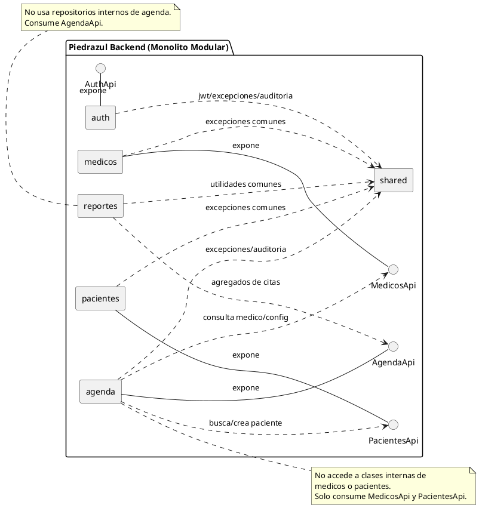

# Modulos y Comunicacion (Monolito Modular)

Este es el documento canonico para entender como se organizan los modulos del backend y como colaboran entre si.

## Principio de diseno

- El sistema es un monolito modular con fronteras explicitas por dominio.
- Cada modulo encapsula su implementacion interna.
- La comunicacion entre modulos se hace por contratos publicos (`*Api`).
- No se permite consumo directo de repositorios/entidades internas de otro modulo.

## Vista de modulos

| Modulo | Responsabilidad principal | Endpoints principales |
| --- | --- | --- |
| `shared` | Seguridad Resource Server, auditoria y excepciones comunes | Sin endpoints directos |
| `auth` | Registro de usuarios y sincronizacion con Keycloak | `POST /api/v1/auth/register/*` |
| `agenda` | Citas manuales, agenda por medico/fecha, disponibilidad y agenda dinamica | `GET /api/v1/citas/agenda`, `POST /api/v1/citas/manual`, `GET /api/v1/citas/disponibilidad/primera`, `GET /api/v1/citas/disponibilidad/primera/global`, `GET /api/v1/citas/agenda-dinamica`, `POST /api/v1/citas/prioridad`, `POST /api/v1/citas/autonomo` |
| `medicos` | Catalogo de medicos y configuracion de agenda por medico | `GET /api/v1/medicos`, `GET /api/v1/medicos/{medicoId}/configuracion`, `PUT /api/v1/medicos/{medicoId}/configuracion` |
| `pacientes` | Consulta de pacientes, busqueda por documento y soporte de autocompletado | `GET /api/v1/pacientes`, `GET /api/v1/pacientes/{id}`, `GET /api/v1/pacientes/buscar` |
| `reportes` | Reporteria agregada de citas | `GET /api/v1/reportes/citas` |

## Elementos relevantes por modulo

### `shared`

- `SecurityConfig` (validacion JWT y conversion de roles)
- `AuditService`
- `BusinessRuleException`, `ResourceNotFoundException`

### `auth`

- Login delegado a Keycloak (el backend no emite tokens).
- Registra usuarios por rol (`PACIENTE`, `ADMIN`, `MEDICO`).

### `agenda`

- Contiene la logica principal de negocio para citas.
- RF-03 (`/citas/autonomo`) esta expuesto pero con implementacion de servicio pendiente.

### `medicos`

- Gestiona configuracion de atencion por profesional.
- Provee contrato para que agenda consulte disponibilidad y parametros.

### `pacientes`

- Provee consulta operativa y busqueda rapida.
- Soporta flujo de cita manual reutilizando/creando paciente por documento.

### `reportes`

- Construye indicadores sin acoplarse a entidades internas de agenda.
- Consume contrato `AgendaApi`.

## Contratos publicos entre modulos

Contratos activos:

- `AuthApi`
- `AgendaApi`
- `MedicosApi`
- `PacientesApi`

## Mapa de consumo entre modulos

| Modulo consumidor | Contrato que consume | Proposito |
| --- | --- | --- |
| `agenda` | `MedicosApi` | Validar medico activo y obtener configuracion de atencion |
| `agenda` | `PacientesApi` | Buscar/crear paciente por documento y enriquecer respuesta de agenda |
| `reportes` | `AgendaApi` | Obtener agregados de citas sin depender de clases internas de agenda |

## Dependencias permitidas observadas

En `agenda/package-info.java`, el modulo `agenda` declara dependencias permitidas hacia:

- `medicos::api`
- `medicos::api-dto`
- `pacientes::api`
- `pacientes::api-dto`
- `shared::exception`
- `shared::audit`

## Diagrama PlantUML de modulos y comunicacion

## Control de arquitectura

El test `src/test/java/com/piedrazul/backend/ModularityTest.java` valida que:

- no existan dependencias ciclicas,
- se respeten fronteras de modulo,
- la aplicacion cumpla reglas definidas por Spring Modulith.
