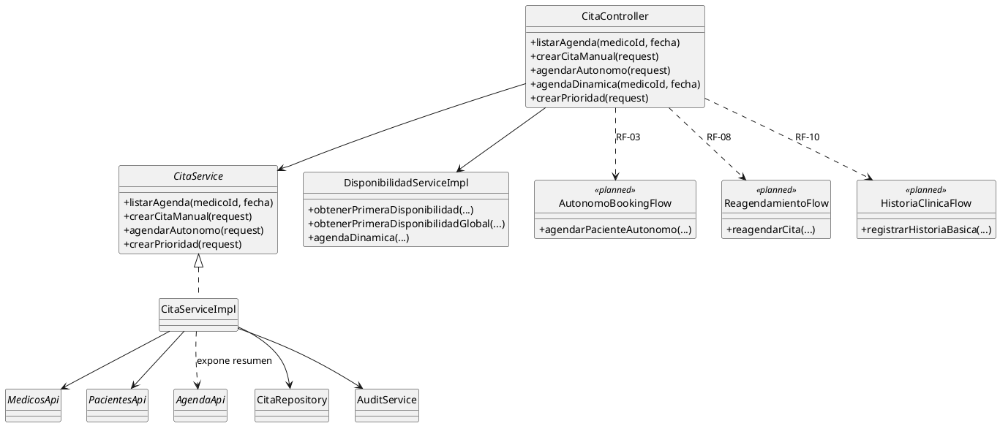

# Diagramas C4 en PlantUML

Este documento centraliza la version editable de los diagramas C4 usando PlantUML.

Objetivo:

- Mantener una vista coherente con lo implementado hoy en el backend.
- Dejar explicito lo planificado/pendiente para no perder trazabilidad arquitectonica.

## Requisitos para renderizar

Los bloques usan la libreria `C4-PlantUML` por URL. Si tu entorno no permite `!includeurl`, descarga la libreria localmente y reemplaza los `include`.

## C1 - Contexto

```plantuml
@startuml C1_Contexto_Piedrazul
!includeurl https://raw.githubusercontent.com/plantuml-stdlib/C4-PlantUML/master/C4_Context.puml

LAYOUT_LEFT_RIGHT()

Person(paciente, "Paciente", "Agenda citas de forma asistida o autonoma (RF-03 pendiente)")
Person(agendador, "Agendador de citas", "Gestiona agenda manual y disponibilidad")
Person(medico, "Medico/Terapista", "Consulta agenda y participa en atencion")
Person(admin, "Administrador", "Configura parametros y gobierno del sistema")

System(backend, "Piedrazul Backend", "Monolito modular Spring Boot para agendamiento, seguridad y reportes")

System_Ext(frontend, "Frontend Web / Cliente API", "Cliente actual o futuro para consumir endpoints")
System_Ext(notificaciones, "Servicio de notificaciones (planeado)", "Canal email/WhatsApp/SMS para confirmaciones")

Rel(frontend, backend, "Consume API REST", "HTTPS/JSON")
Rel(paciente, frontend, "Opera desde interfaz web")
Rel(agendador, frontend, "Opera desde interfaz interna")
Rel(medico, frontend, "Consulta agenda diaria")
Rel(admin, frontend, "Administra el sistema")

Rel(backend, notificaciones, "Envia alertas de citas", "Evento/API (planeado)")

SHOW_LEGEND()
@enduml
```

## C2 - Contenedores

```plantuml
@startuml C2_Contenedores_Piedrazul
!includeurl https://raw.githubusercontent.com/plantuml-stdlib/C4-PlantUML/master/C4_Container.puml

LAYOUT_LEFT_RIGHT()

Person(usuario, "Usuario del sistema", "Paciente, Agendador, Medico/Terapista, Admin")
System_Ext(frontend, "Frontend Web / Cliente API", "Interfaz de consumo")

System_Boundary(s1, "Piedrazul Backend") {
  Container(api, "API Spring Boot", "Java 17, Spring Boot, Spring Security, Spring Data JPA", "Expone endpoints de auth, agenda, medicos, pacientes, reportes")
  ContainerDb(db, "PostgreSQL", "RDBMS", "Persistencia principal en dev")
}

Rel(usuario, frontend, "Usa")
Rel(frontend, api, "Consume", "HTTPS/JSON")
Rel(api, db, "Lee/Escribe", "JPA/Hibernate")

SHOW_LEGEND()
@enduml
```

Nota de modelado C2:

- En C4, un contenedor representa una unidad ejecutable/desplegable.
- Dado que el sistema actual es un monolito modular, la exportacion (RF-09) se modela como componente interno de la API, no como servicio aparte.
- Solo se modelaria un contenedor separado si mas adelante se decide extraer un proceso batch/worker independiente por escalabilidad u operacion.

## C3 - Componentes (contenedor API Spring Boot)

```plantuml
@startuml C3_Componentes_Piedrazul
!includeurl https://raw.githubusercontent.com/plantuml-stdlib/C4-PlantUML/master/C4_Component.puml

LAYOUT_TOP_DOWN()

Person(usuario, "Usuario autenticado")
ContainerDb(db, "PostgreSQL", "RDBMS")

Container_Boundary(api, "API Spring Boot (Monolito modular)") {
  Boundary(modAuth, "Modulo auth") {
    Component(authController, "AuthController", "REST Controller", "Login y registro")
    Component(authService, "AuthServiceImpl", "Service", "Autenticacion JWT y registro de usuarios")
    Component(usuarioRepo, "UsuarioRepository", "Repository", "Persistencia de usuarios")
  }

  Boundary(modAgenda, "Modulo agenda") {
    Component(citaController, "CitaController", "REST Controller", "Agenda, disponibilidad, cita manual/autonoma/prioridad")
    Component(citaService, "CitaServiceImpl", "Service", "Reglas de agenda y creacion de citas")
    Component(disponibilidadService, "DisponibilidadServiceImpl", "Service", "Calculo de slots y disponibilidad")
    Component(citaRepository, "CitaRepository", "Repository", "Persistencia de citas")
    Component(autonomoFlow, "AutonomoBookingFlow", "Planned Component", "Implementacion completa RF-03")
    Component(reagendaFlow, "ReagendamientoFlow", "Planned Component", "Implementacion RF-08")
  }

  Boundary(modPacientes, "Modulo pacientes") {
    Component(pacientesController, "PacienteController", "REST Controller", "Consulta y busqueda de pacientes")
    Component(pacientesService, "PacienteService", "Service", "Logica de pacientes")
    Component(pacienteRepo, "PacienteRepository", "Repository", "Persistencia de pacientes")
    Component(pacientesApi, "PacientesApi", "Contrato interno", "Interfaz publica del modulo pacientes")
  }

  Boundary(modMedicos, "Modulo medicos") {
    Component(medicosController, "MedicoController", "REST Controller", "Consulta/configuracion de medicos")
    Component(medicosService, "MedicoService", "Service", "Logica de medicos")
    Component(medicoRepo, "MedicoRepository", "Repository", "Persistencia de medicos")
    Component(medicosApi, "MedicosApi", "Contrato interno", "Interfaz publica del modulo medicos")
  }

  Boundary(modReportes, "Modulo reportes") {
    Component(reportesController, "ReporteController", "REST Controller", "Reportes de citas")
    Component(reportesService, "ReporteService", "Service", "Consolidacion de metricas")
    Component(agendaApi, "AgendaApi", "Contrato interno", "Interfaz publica del modulo agenda")
  }

  Boundary(modShared, "Modulo shared") {
    Component(auditService, "AuditService", "Shared Service", "Auditoria de operaciones criticas")
    Component(historiaFlow, "HistoriaClinicaFlow", "Planned Component", "Implementacion RF-10")
  }
}

Rel(usuario, authController, "Invoca")
Rel(usuario, citaController, "Invoca")
Rel(usuario, pacientesController, "Invoca")
Rel(usuario, medicosController, "Invoca")
Rel(usuario, reportesController, "Invoca")

Rel(authController, authService, "Usa")
Rel(authService, usuarioRepo, "Usa")
Rel(citaController, citaService, "Usa")
Rel(citaController, disponibilidadService, "Usa")
Rel(citaService, citaRepository, "Usa")
Rel(citaService, medicosApi, "Consulta")
Rel(citaService, pacientesApi, "Consulta/crea")
Rel(reportesController, reportesService, "Usa")
Rel(reportesService, agendaApi, "Consulta")
Rel(pacientesController, pacientesService, "Usa")
Rel(pacientesService, pacienteRepo, "Usa")
Rel(medicosController, medicosService, "Usa")
Rel(medicosService, medicoRepo, "Usa")
Rel(citaService, auditService, "Registra eventos")

Rel(citaRepository, db, "Lee/Escribe")
Rel(usuarioRepo, db, "Lee/Escribe")
Rel(pacienteRepo, db, "Lee/Escribe")
Rel(medicoRepo, db, "Lee/Escribe")

Rel(citaController, autonomoFlow, "Delegara en RF-03", "pendiente")
Rel(citaController, reagendaFlow, "Delegara en RF-08", "pendiente")
Rel(citaController, historiaFlow, "Delegara en RF-10", "pendiente")

SHOW_LEGEND()
@enduml
```

> Nota: en el C3 se muestran componentes `Planned Component` para reflejar el estado "implementado y por implementar" solicitado.

## C4 - Codigo (modulo agenda)



## Referencia de estado

- Implementado: RF-01, RF-02, RF-06 (y funcionalidades parciales RF-04, RF-05, RF-07, RF-11, RF-12)
- Pendiente: RF-03, RF-08, RF-09, RF-10

Fuente de verdad funcional actual:

- [`../README.md`](../../README.md)
- [`../03-requisitos/03-cumplimiento-rf.md`](../03-requisitos/03-cumplimiento-rf.md)


